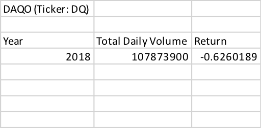
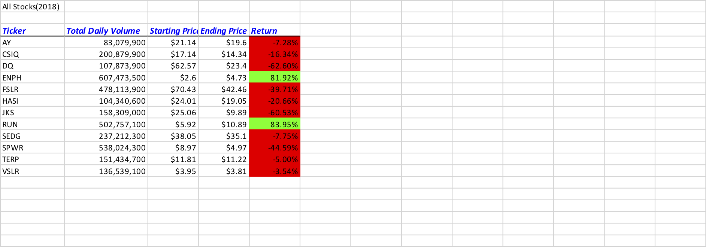
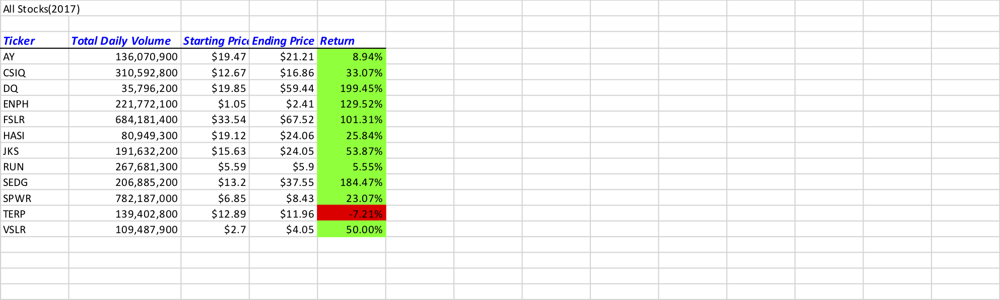

# stock-analysis

## Module 1 in VBA 
    Analyzed the DQ stock in the year 2018 based on the data provided. Calculated total daily volume of stocks traded , rate of return for the entire year. This would allow Steve to find the state of DQ stock in the past year and to recommend his Dad about his DQ stock investment.

    
## Module 4 in VBA
   For the same 2018 year added programmatic logic to iterate over all the stocks. Calculated total daily volume of stocks traded , rate of return for the entire year. With additional formatting we were able to highlight the stock which has positive returns and the stocks which has negative returns for the year 2018. Since Steve is looking for a better stock for his Dad's portfolio this would help him better.

## Challenge
### Module 2 in VBA
   Refactored the code to take year as an input and based on the year selected read the corresponding sheet to get the list of tickers and their corresponding startingPrice, endingPrice, totalDailyVolume of stocks traded. By doing this we should be able to use this code to analyse any years data and figure out the rate of return for each stock quickly and make a better judgement. In our case Steve would be able to look both 2017, 2018 data. Though DQ stock performed really well on 2017 with close to 200% rate of return the subsequent year the rate return was in negtive with 62% while ENPH had profit for both 2017 and 2018 with 129% and 81% respectively. So Steve would be able to recommend ENPH stock for his Dad's portfolio compared to DQ. Look at the attached 2017 and 2018 stock analysis
   

